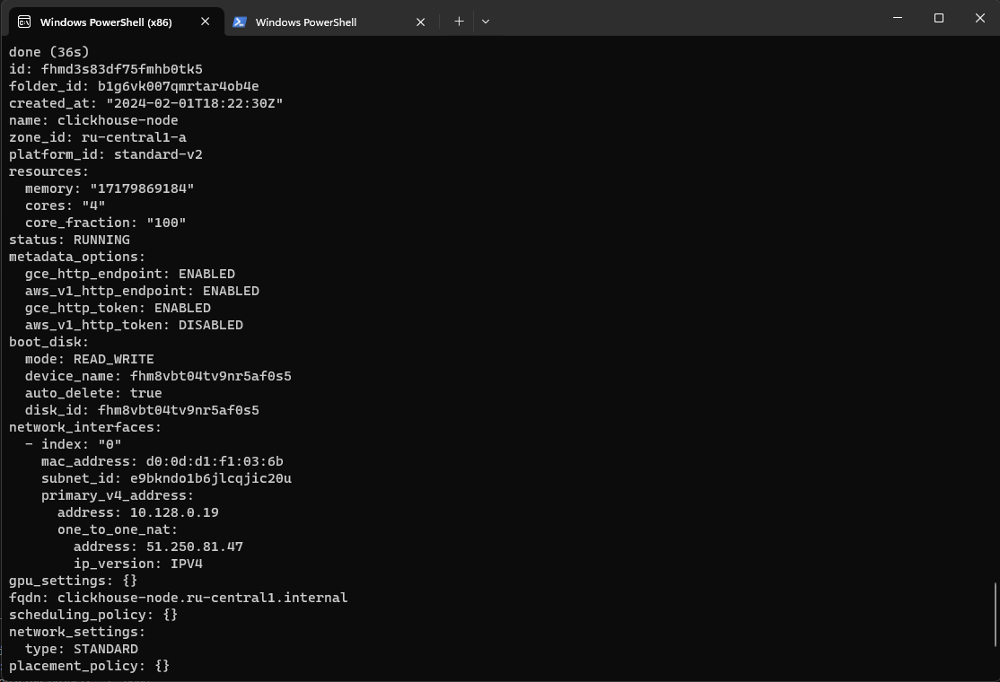
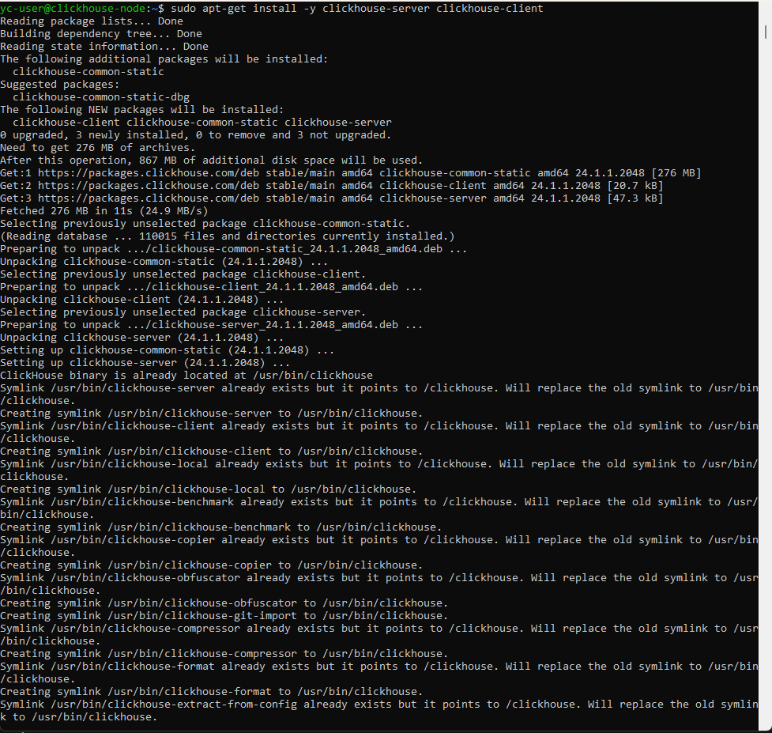
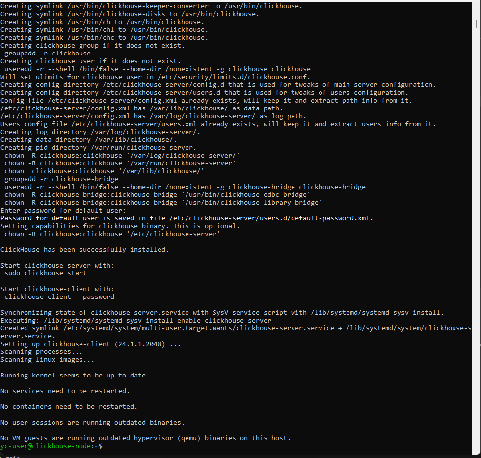
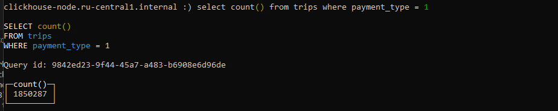

# Отчет по домашнему заданию 1

### Задачи
1. Получить промокоды на Yandex Cloud и зарегистрироваться в Yandex Cloud, установить YC CLI.
   
   
   [Результат](create-yandex-cloud-vm.log)
2. Установить ClickHouse.

   [Лог установки cilckhouse](install-clickhouse.log)

   

   

3. Подгрузить датасет для примера и сделать селект из таблицы.

   

4. Для проверки отправить скрины работающего контейнера, созданной виртуальной машины и результата запроса select count() from trips where payment_type = 1.
